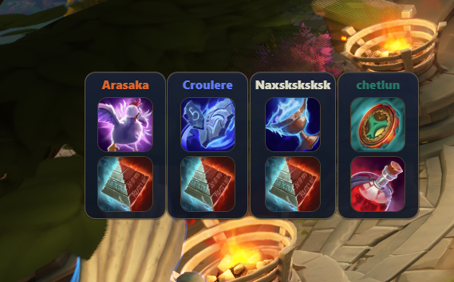

# Fellowship Overlay

Created by **LionBlackVMP**.



Compact desktop overlay for **Fellowship**.  
It reads the game's combat logs and shows party **trinket cooldowns** and **Spirit** in a small in-game frame.

## Important Note

The overlay depends on Fellowship combat logs, so updates are **not instant**.

- In normal gameplay, log delay is usually around **5-10 seconds**
- In very large or chaotic fights, the log may skip minor events and write only the main ones
- In those cases, trinket updates can be delayed much more, sometimes up to **~30 seconds**

## Install

Download the latest installer from [GitHub Releases](https://github.com/LionBlackVMP/Fellowship-overlay/releases).

On Windows:

1. In **GitHub Releases**, download the latest `fellowship-overlay_0.x.x_x64-setup.exe`
2. Run the installer
3. Open **Fellowship Overlay**
4. In the settings window, choose your `CombatLogs` folder

## Development

Install dependencies:

```bash
npm install
```

Run dev mode:

```bash
npm run tauri dev
```

Build production:

```bash
npm run tauri build
```

## Stack

- Tauri 2
- React + TypeScript
- Redux Toolkit
- Rust backend log parser
